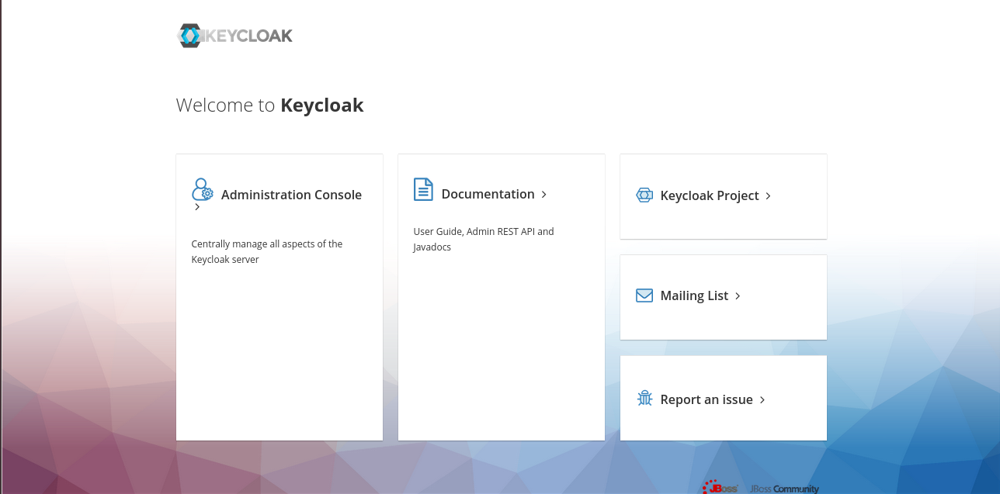

Ansible Role: osm_keycloak
=========

[![Opstree Solutions][opstree_avatar]][opstree_homepage]<br/>[Opstree Solutions][opstree_homepage] 

  [opstree_homepage]: https://opstree.github.io/
  [opstree_avatar]: https://img.cloudposse.com/150x150/https://github.com/opstree.png

An ansible role to install and configure Keycloak server.

Version History
---------------

|**Date**| **Version**| **Description**| **Changed By** |
|----------|---------|---------------|-----------------|
|**May '10** | v.1.0 | Initial Draft | Abhishek Vishwakarma |

Salient Features
----------------
* This role will fetch and install keycloak version 8.0.1 but if you want to install a specific veriosn you may pass it in variables.


Supported OS
------------
  * CentOS:7
  * CentOS:6
  * Ubuntu:bionic
  * Ubuntu: xenial

Dependencies
------------
* Java

Role Variables
--------------

We are using below mention variables in this role.

|**Variables**| **Default Values**|**Description**|
|---|---|---|
| keycloak_version | 8.0.1 | Version of keycloak server |
| base_url | https://downloads.jboss.org/keycloak | Base url in keycloak to install keycloak |
| version_url | /6.0.1/keycloak-6.0.1.tar.gz | Version specificaton in keycloak url |
| keycloak_url_location | {{ base_url }}{{ version_url }} | Url to download keycloak |
| username | root | Username for administartor in keycloak |
| password | root123 | Password for administartor in keycloak 

## Inventory
------------

An inventory should look like this:-
```ini
[keycloakhost]                 
192.168.1.194    ansible_user=ubuntu
192.168.3.138    ansible_user=centos
192.168.1.152    ansible_user=opstree                      
```

Example Playbook
----------------

Here is an example playbook:-
```yml
---
- hosts: keycloakhost
  roles:
    - role: osm_keycloak
      become: yes
```

Usage
----------------

For using this role you have to execute playbook only
```shell
ansible-playbook -i hosts site.yml
```

**After the successful installation of keycloak, browse through the keycloak url and you would get your login page**


Future Proposed Changes
-----------------------

References
----------
- **[software](https://www.keycloak.org/)**


Author Information
------------------

**[Abhishek Vishwakarma](mailto:abhishek.vishwakarma@opstree.com)*
